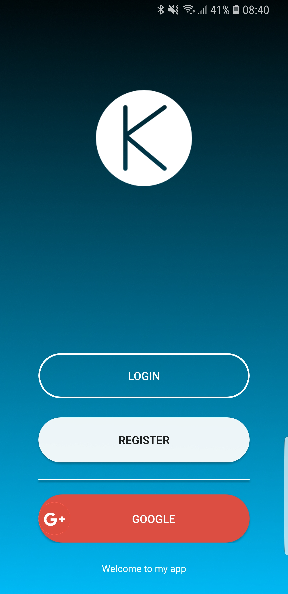
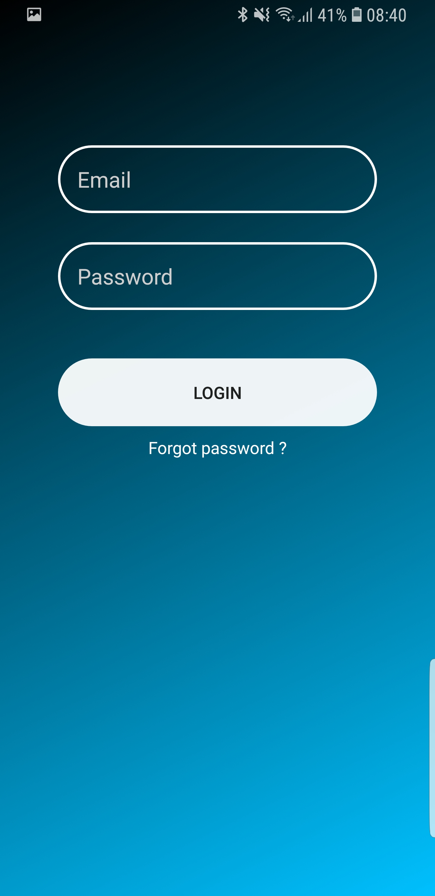

# Java Login

  

## Setup

You need to setup your firebase app and add ```google-services.json``` to project and ```request_client_id``` to strings
 to make this login work.


## Using

* [Firebase](https://firebase.google.com/) - Firebase noSQL database and firebase Auth

## License

This project is licensed under the MIT License - see the [LICENSE](https://github.com/kubekbreha/AndroidAppParts/blob/master/LICENCE) file for details
